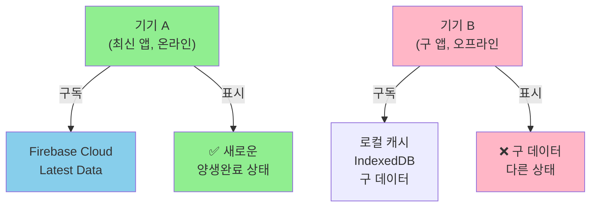

# 🔴 Issue: 양생완료(CURED) 실시간 업데이트가 기기별로 다르게 표시됨

## 문제 설명

**"단지배치현황"(Complex Layout Status) 화면에서:**
- **양생완료** 상태가 기기별로 다르게 표시됨 (리얼타임 동기화 안됨)
- **갱폼인상완료** 상태는 정상 작동 (모든 기기에서 일치)

이는 두 데이터가 **서로 다른 Firebase 데이터 소스**를 사용하고 있기 때문.

---

## 핵심 원인: 데이터 소스의 불일치

### 1️⃣ 양생완료 (CURED) - ❌ 문제 있음

| 항목 | 값 |
|------|---|
| **저장 위치** | `buildings/{buildingId}` (각 building 문서) |
| **구조** | 각 `unit.status` = "양생완료" |
| **업데이트 방식** | 유닛 단위 (세밀함) |
| **구독** | `onSnapshot(collection(db, "buildings"))` |
| **데이터 정규화** | ✅ `normalizeBuildingsWithDrawingData()` 적용 (무거움) |
| **캐시 정책** | IndexedDB 활성화 → 기기별 다른 캐시 상태 |

```
Firebase: {
  buildings: {
    "b-2006": {
      floors: [
        { 
          level: 15, 
          units: [
            { id: "...", status: "양생완료" }  ← 여기
          ]
        }
      ]
    }
  }
}
```

### 2️⃣ 갱폼인상완료 - ✅ 정상 작동

| 항목 | 값 |
|------|---|
| **저장 위치** | `site_data/gangform_ptw` (별도 단일 문서) |
| **구조** | `records[buildingId]` 통합 저장 |
| **업데이트 방식** | 건물 단위 (단순) |
| **구독** | `onSnapshot(doc(db, "site_data", "gangform_ptw"))` |
| **데이터 정규화** | ❌ 없음 (가벼움) |
| **캐시 정책** | IndexedDB 활성화 하지만 간단해서 문제 없음 |

```
Firebase: {
  site_data: {
    gangform_ptw: {
      records: {
        "b-2006": {
          floor: "15층",
          status: "completed",
          updatedAt: "..."
        }
      }
    }
  }
}
```

---

## 코드 위치 매핑

### SiteMap.tsx에서 두 데이터의 처리

```typescript
// 양생완료 처리 (Line 46-77)
const getActiveInfo = (building: Building) => {
  const activeUnits = building.floors.flatMap(f => f.units)
    .filter(u => !u.isDeadUnit && u.status !== ProcessStatus.NOT_STARTED);
  
  const curedList = activeUnits.filter(u => u.status === ProcessStatus.CURED);
  if (curedList.length > 0) {
    const highestCured = curedList.reduce((prev, curr) => {
      const prevFloor = parseInt(prev.id.split('-')[1]);
      const currFloor = parseInt(curr.id.split('-')[1]);
      return prevFloor > currFloor ? prev : curr;
    });
    return { floor: highestCured.id.split('-')[1] + 'F', status: ProcessStatus.CURED };
  }
};
// ❌ 문제: buildings prop이 정규화되면서 느려지고, 
//    기기별 다른 버전의 캐시에서 읽을 수 있음

// 갱폼인상 처리 (Line 181-183)
const gangformRecord = gangformByBuilding[building.id];
const gangformFloor = parseGangformFloor(gangformRecord?.payload?.floor);
const gangformStatus = gangformRecord?.status ?? null;
// ✅ 정상: gangformByBuilding은 별도의 간단한 매핑이고, 
//    캐시도 잘 관리됨
```

### Firebase 구독 차이

**양생완료 (App.tsx Line 535):**
```typescript
const unsubscribe = syncBuildings((serverBuildings, isLive) => {
  setIsConnected(isLive);
  const normalizedBuildings = normalizeBuildingsWithDrawingData(serverBuildings);
  // ⚠️ 무거운 정규화 작업 + 오프라인 캐시 혼재
  setBuildings(normalizedBuildings);
});
```

**갱폼인상 (App.tsx Line 661):**
```typescript
const unsubscribe = subscribeToGangformPtwData((records: GangformPtwStoredMap) => {
  const mapped = Object.entries(records || {}).reduce((acc, [buildingId, record]) => {
    // ✅ 간단한 매핑만 수행
    acc[buildingId] = { payload, status, updatedAt, ... };
    return acc;
  }, {});
  setGangformPtwByBuilding(mapped);
});
```

---

## 왜 기기별로 다르게 표시되나?



---

## 🔧 해결 방안 (우선순위)

### 🟥 High Priority (즉시)

1. **Firebase 오프라인 캐시 정책 수정**
   ```typescript
   // firebaseService.ts Line 62
   db = initializeFirestore(app, {
       cacheSizeBytes: 10 * 1024 * 1024,  // 제한된 캐시 크기
       ignoreUndefinedProperties: true
   });
   ```

2. **캐시 상태 확인 및 강제 동기화**
   ```typescript
   // App.tsx의 syncBuildings() 콜백
   syncBuildings((serverBuildings, isLive) => {
       if (!isLive) {
           console.warn("⚠️ Using CACHED data - not latest!");
           // 캐시 사용 시 사용자에게 알림
       }
       // ...
   });
   ```

### 🟨 Medium Priority (1-2주)

3. **양생완료를 갱폼처럼 분리된 저장소로 이동**
   ```typescript
   // 새로운 Firestore 구조
   site_data/al_curing_status: {
       records: {
           "b-2006": { floor: 15, curedCount: 8, ... }
       }
   }
   ```

4. **SiteMap에서 직접 구독 (간접 구독 줄이기)**
   ```typescript
   // SiteMap.tsx에 추가
   useEffect(() => {
       const unsubscribe = subscribeToAlCuringStatus((records) => {
           setCuringRecords(records);
       });
       return () => unsubscribe();
   }, []);
   ```

### 🟩 Low Priority (개선)

5. **WebSocket 또는 Server-Sent Events 도입**
   - Firestore Realtime이 아닌 직접 API 호출

6. **기기별 동기화 상태 모니터링**
   - 마지막 동기화 타임스탐프 추적
   - UI에 "정보 업데이트됨" 배너 표시

---

## 📋 테스트 방법

### 현재 상황 확인:
1. 기기 A에서 양생완료 업데이트 (예: 2006동 15층)
2. 기기 B 새로고침 없이 확인
3. **기기 B에서 이전 상태 표시되면 캐시 문제 확인됨**

### 수정 후 테스트:
1. 기기 A에서 업데이트
2. 기기 B에서 **즉시** (새로고침 없이) 동기화 확인
3. 갱폼인상 수준의 실시간성 달성

---

## 📁 관련 파일 요약

| 파일 | 라인 | 설명 |
|------|------|------|
| `/App.tsx` | 529-649 | Firebase 구독 & 상태 관리 |
| `/App.tsx` | 150-207 | normalizeBuildingsWithDrawingData() |
| `/components/SiteMap.tsx` | 46-90 | getActiveInfo() (양생완료 처리) |
| `/components/SiteMap.tsx` | 181-196 | 갱폼 데이터 처리 |
| `/services/firebaseService.ts` | 62-66 | IndexedDB 설정 |
| `/services/firebaseService.ts` | 90-116 | syncBuildings 구독 |
| `/services/firebaseService.ts` | 247-263 | subscribeToGangformPtwData 구독 |
| `/types.ts` | 15 | ProcessStatus.CURED 정의 |

---

## 🎯 다음 단계

1. ✅ **분석 완료** → 이 파일 참고
2. ⏳ **High Priority 수정 적용** (위 "해결 방안" 참고)
3. ⏳ **테스트** (기기별 동기화 확인)
4. ⏳ **Medium Priority 리팩토링** (구조 개선)
5. ⏳ **모니터링** (프로덕션 배포 후)

